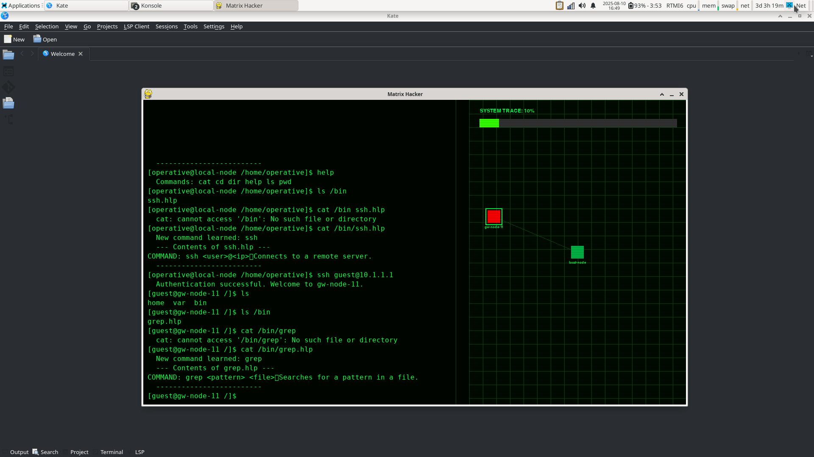

# Matrix Hacker: The Genesis Echo

**A Procedurally Generated Hacking Simulation with Dynamic Economy and Layered Narrative**



---

## Executive Summary

`Matrix Hacker: The Genesis Echo` is a sophisticated, terminal-based hacking simulation designed to showcase robust software architecture, dynamic content generation, and engaging gameplay mechanics. Players assume the role of a "Data Archaeologist" navigating a procedurally generated digital underworld, uncovering a deep, multi-layered narrative while managing resources and upgrading their hacking toolkit.

This project demonstrates proficiency in:
*   **Modular and Scalable Software Design:** Transitioned from a monolithic structure to a clean, maintainable, and extensible multi-module architecture.
*   **Complex System Integration:** Seamlessly combines game state management, UI rendering, command processing, and dynamic content generation.
*   **Algorithmic Content Creation:** Implements advanced procedural generation techniques for unique campaign experiences.
*   **User Experience (UX) Design:** Focuses on immersive, text-based interaction with clear feedback mechanisms.

---

## Core Gameplay Loop

The game begins on your personal `home-pc`, a safe haven where you manage your resources and plan your next move. From here, you connect to your `work-serv`, provided by the enigmatic Chronosync corporation, to undertake high-stakes data retrieval missions. As you delve deeper into the Aethelred Sub-Net, you'll discover hidden Black Markets to purchase crucial software and hardware upgrades, all while managing your `system_trace` – a dynamic indicator of your digital footprint. Every action contributes to a layered narrative, revealing fragments of a truth far grander than your initial contract.

---

## Key Features & Technical Highlights

### 1. Modular & Scalable Architecture
The project has been meticulously refactored from a single Python file into a well-organized, multi-module structure. This design promotes:
*   **Separation of Concerns:** Dedicated modules for core game logic (`core/`), user interface (`ui/`), campaign generation (`campaign/`), and global settings (`settings.py`).
*   **Maintainability:** Easier debugging and feature development.
*   **Extensibility:** New commands, mission types, and game mechanics can be added with minimal impact on existing code.

### 2. Procedural Content Generation
Experience a unique campaign with every playthrough. The `CampaignGenerator` dynamically creates:
*   **Multi-Mission Campaigns:** A series of interconnected networks, each with specific objectives.
*   **Varied Mission Templates:** Missions requiring diverse hacking tools like `grep` (log analysis), `find` (file discovery), and `tcpdump` (network traffic analysis).
*   **Dynamic Clue Placement:** Ensures a solvable path through each generated network.

### 3. Advanced Intel & Quest System
Your `Intel` panel serves as a dynamic quest log and information hub:
*   **Structured Data:** Stores discovered IP addresses, associated descriptions, usernames, and passwords in a rich, accessible format.
*   **Dynamic Updates:** Information is automatically parsed from files (`cat` command) and instantly reflected on the HUD.
*   **Clear Progression:** Guides the player through complex multi-step puzzles.

### 4. Dynamic Economy & Resource Management ("Operation: Black Market")
A robust in-game economy drives player progression and strategic choice:
*   **Dual Currency System:** Earn `Creds` (software currency) from Chronosync missions and `Chips` (hardware currency) from high-risk side jobs.
*   **Persistent Player Profile:** All progress, including learned commands, currency, and hardware inventory, is saved and loaded via `profile.json`.
*   **Black Market:** A hidden, command-line accessible server where players can purchase new hacking tools and hardware upgrades.
*   **Hardware Integration:** Purchased hardware dynamically influences gameplay mechanics, such as reducing `system_trace` accumulation.

### 5. Immersive Command-Line Interface
The game delivers an authentic retro-terminal experience:
*   **Expanded Command Set:** Features a growing suite of realistic Unix-like commands.
*   **Dynamic System Trace:** A visual and mechanical representation of your digital footprint, increasing on remote servers and decreasing in safe zones.
*   **Main Menu:** Provides clear options to load or start a new game.

---

## Technical Stack

*   **Python 3.x**
*   **Pygame:** For graphics and input handling.
*   **Standard Library:** `json`, `os`, `re`, `random`, `time`, `sys`.

---

## Installation & Setup

1.  **Clone the repository:**
    ```bash
    git clone https://github.com/your-username/matrix-hacker.git
    cd matrix-hacker
    ```

2.  **Set up a virtual environment (recommended):**
    ```bash
    python3 -m venv venv
    source venv/bin/activate
    ```

3.  **Install dependencies:**
    ```bash
    pip install -r requirements.txt
    ```

4.  **Run the game:**
    ```bash
    python3 main.py
    ```

---

## Project Structure

```
matrix-hacker/
├── core/               # Core game logic (filesystem, network, commands, market_commands)
├── ui/                 # User Interface components (console, map, trace bar)
├── campaign/           # Procedural generation and narrative (generator, lore)
├── profile_manager.py  # Handles player profile saving and loading
├── main.py             # Main application entry point and menu handler
├── game.py             # Core Game class, state management, and main loop
├── settings.py         # Global game constants and configuration
├── requirements.txt    # Project dependencies
├── screenshot.png      # Project screenshot (replace with your own!)
└── LICENSE             # Project license (MIT)
```

---

## License

This project is licensed under the MIT License. See the [LICENSE](LICENSE) file for details.

---
*Copyright (c) 2025 Radu Tataru-Marinescu*
